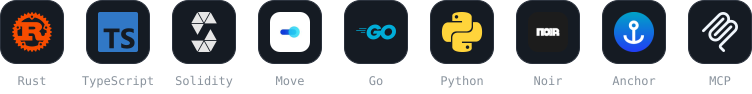
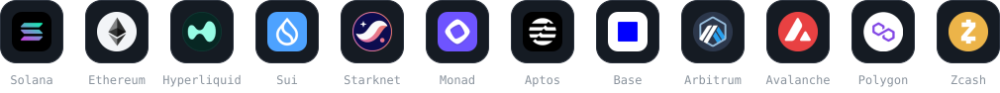
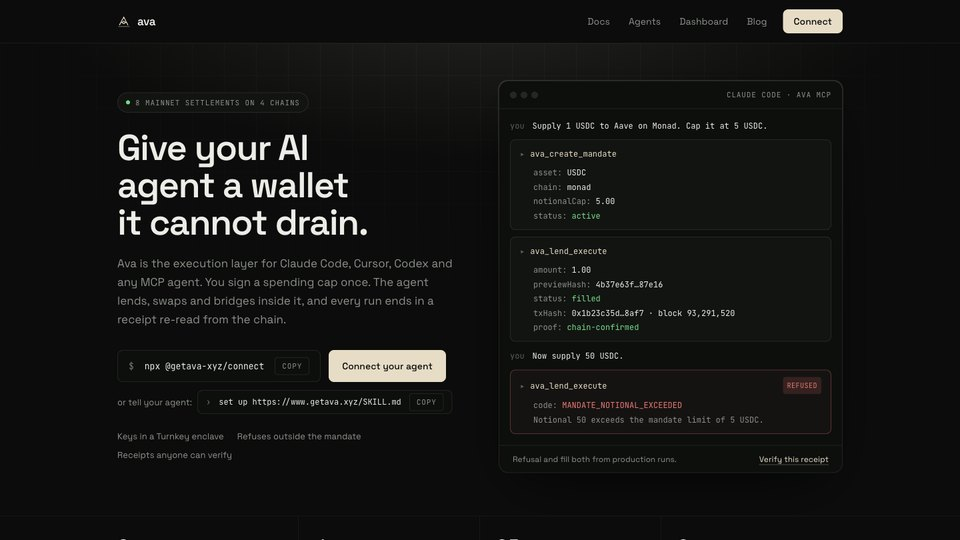
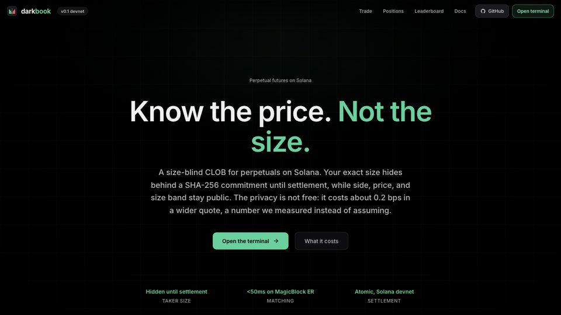
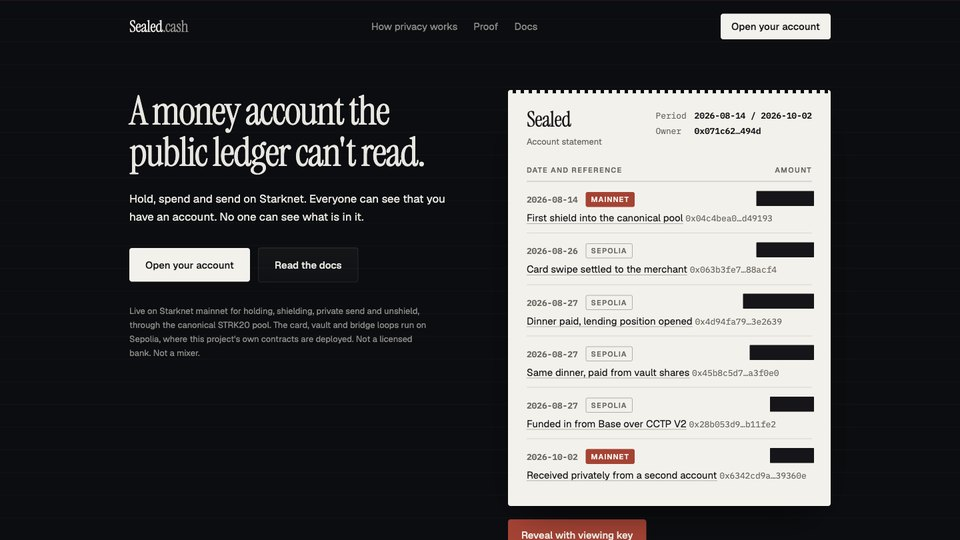
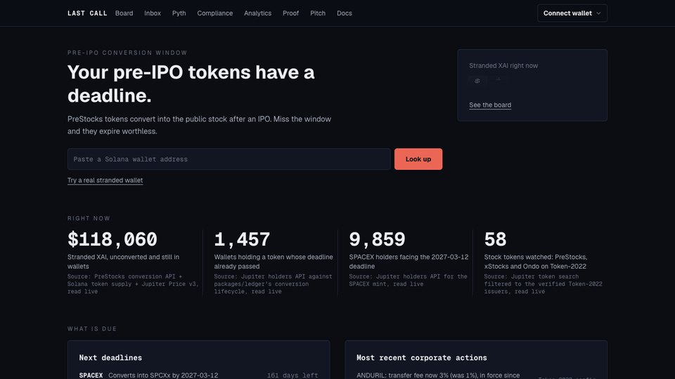

  

I've spent years at the frontier where autonomous agents meet programmable money: agents that trade, lend and settle on mainnet, private orderbooks that match in under 50ms, zero-knowledge circuits, and the tooling that keeps all of it honest. I like the hard part: making the demo survive contact with real users and real funds.

<h3 align="center">Stack</h3>

<h3 align="center">Shipped on</h3>

## Featured

<table>
  <tr>
    <td width="50%" valign="top">
      
      <h3><a href="https://www.getava.xyz">Ava</a></h3>
      MCP server that gives Claude Code, Cursor and Codex a wallet they cannot drain. Signed spending caps, deterministic policy, typed refusals, receipts re-read from the chain. 8 mainnet settlements across 4 chains.
    </td>
    <td width="50%" valign="top">
      
      <h3><a href="https://github.com/kamalbuilds/darkbook">DarkBook</a></h3>
      Size-blind orderbook for Solana market makers. Taker size stays hidden behind a commitment until settlement, matching runs under 50ms on MagicBlock ephemeral rollups, settlement is atomic on Solana.
    </td>
  </tr>
  <tr>
    <td width="50%" valign="top">
      
      <h3><a href="https://sealed.cash">sealed.cash</a></h3>
      A money account the public ledger can't read. Hold, spend and send on Starknet through the STRK20 privacy pool without publishing your salary or net worth.
    </td>
    <td width="50%" valign="top">
      
      <h3><a href="https://lastcall-sol.vercel.app">Last Call</a></h3>
      Finds PreStocks pre-IPO tokens stranded in Solana wallets and converts them before the deadline, even when the holder has 0 SOL. Every figure on the board is read live from Jupiter and the PreStocks API.
    </td>
  </tr>
</table>

## Agents that move money

| Project | What it does |
|:--|:--|
| [**Ava Portfolio Manager**](https://github.com/kamalbuilds/ava-portfolio-manager-ai-agents) | Specialist AI agents that turn a plain-English goal into multi-step DeFi transactions on Avalanche and execute them inside your risk limits. |
| [**SolMate**](https://github.com/kamalbuilds/solmate-the-solana-defi-ai-agent) | A team of autonomous agents that analyze, recommend and execute DeFi strategies on Solana from natural language. |
| [**Nansen Hunt Alpha**](https://github.com/kamalbuilds/nansen-hunt-alpha) · [**Exit Window**](https://github.com/kamalbuilds/exit-window) | Smart-money agents on Nansen data. Hunt Alpha detects coordinated whale clusters with a wallet-graph search and gates every trade through 8 risk factors. Exit Window alarms the moment smart money in your Hyperliquid trade starts selling. |

## Trading infrastructure and privacy

| Project | What it does |
|:--|:--|
| [**HyperTWAP Shield**](https://github.com/kamalbuilds/HyperTWAP-Shield) | TWAP executor built on Hyperliquid's precompiles for private, MEV-resistant, market-aware execution. |
| [**hyperliq-universal-sdk**](https://github.com/kamalbuilds/hyperliq-universal-sdk) | Hyperliquid SDKs in Go, Java and C#, plus a real-time alerting platform on the Node Info API. |
| [**zump.fun**](https://github.com/kamalbuilds/zumpfun) | Privacy-first token launchpad on Starknet with Noir zero-knowledge circuits. |
| [**Revoke × Attestcoin**](https://github.com/kamalbuilds/revoke-attestcoin) | EIP-7702 kill switch: revoke a delegation on Ethereum mainnet and a vault on Creditcoin freezes in the same transaction. |

## Tools for builders and their agents

| Project | What it does |
|:--|:--|
| [**canfail**](https://github.com/kamalbuilds/canfail) | Proves your tests can actually fail. Finds checks that stay green because they cannot go red: vacuous tests, surviving mutants, reachable mocks. |
| [**agent-integrity**](https://github.com/kamalbuilds/agent-integrity) | Tamper tripwire for the skills, hooks, rules and MCP servers your coding agent loads and runs. |
| [**ram-sentinel**](https://github.com/kamalbuilds/ram-sentinel) | Rust watchdog that tells you in plain English what to close before your Mac runs out of memory. |
| [**ane-spike**](https://github.com/kamalbuilds/ane-spike) | Benchmarks int8 matmul on the Apple Neural Engine against GPU and CPU, with Core ML placement proof. |

## AI that checks its own work

| Project | What it does |
|:--|:--|
| [**sightread**](https://github.com/kamalbuilds/sightread) | Audio description that has to fit the silence. Measures the gaps, writes and voices a line for each, re-measures, rejects takes that overrun. |
| [**checkprint**](https://github.com/kamalbuilds/checkprint) | Delivery QC agent that repairs the master file and re-measures to prove the fix. Gemini on Google Cloud with ClickHouse. |
| [**pullback**](https://github.com/kamalbuilds/pullback) | Finds out whether anything in your home has been recalled, then gets the manufacturer's remedy delivered. |
| [**out-of-service**](https://github.com/kamalbuilds/out-of-service) | Accessible NYC subway routing for people and their agents, scored on real elevator outage history. |

## Activity

  
  

## How I build

- **Mainnet or it didn't happen.** A transaction hash beats a slide.
- **Agents need limits, not just prompts.** Every agent I ship knows what it is not allowed to do.
- **Measure, then trust.** If a system claims it worked, it should be able to prove it.
- **Ship fast, then make it real.** Prototypes in a weekend, production in the weeks after.

<b>Recognition</b> · 50+ hackathon wins across ETHGlobal, DoraHacks and more

 

- Archway 2024, ArchID track winner. [buidl](https://dorahacks.io/buidl/13726) · [announcement](https://x.com/archwayHQ/status/1818368483819946256)
- Celestia, finalist. [buidl](https://dorahacks.io/buidl/12724)
- Lambda Hack Brussels, Dora track winner. [buidl](https://dorahacks.io/buidl/14080)
- Dchain 2024 winner. [buidl](https://dorahacks.io/buidl/14291)
- Algorand Change the Game 2023, DeFi track winner. [buidl](https://dorahacks.io/buidl/8000)
- Avalanche Frontier, second place. [buidl](https://dorahacks.io/buidl/10316)
- Polygon APAC DevX, Polygon ID track winner. [buidl](https://dorahacks.io/buidl/6059)
- ETHGlobal: [TradeSphere](https://ethglobal.com/showcase/tradesphere-5vdrw) · [XChain Investments](https://ethglobal.com/showcase/xchain-investments-4fu2t) · [Gas Protocol](https://ethglobal.com/showcase/gas-protocol-46m74)

## Let's build

Open to collaborations with teams pushing AI agents and on-chain systems forward.

  
  
  
  

